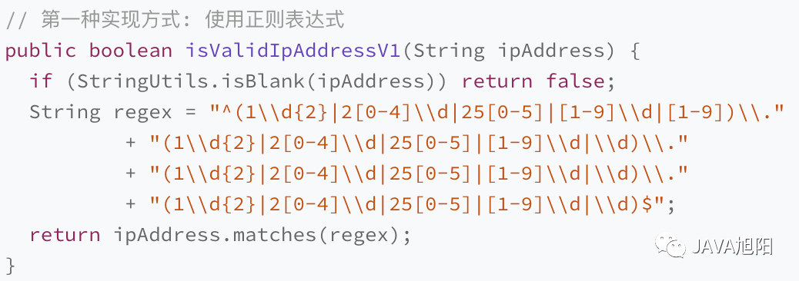
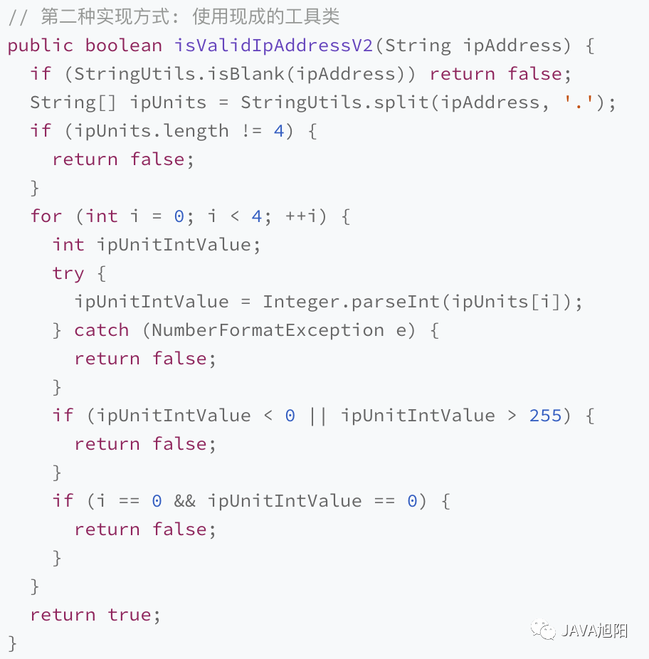
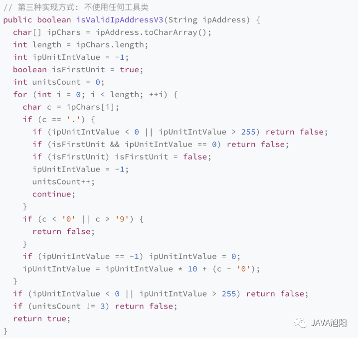

# 编程小原则

## kiss

> Keep It Simple, Stupid!

## day

> Don't Repeat Yourself

## solid

> 一个类应该有一个，而且只有一个改变它的理由。
>
> 软件实体（类、模块、函数等）应该对扩展开放，对修改关闭。
>
> 派生类或子类必须可替代其基类或父类
>
> 接口不应该强迫他们的客户依赖它不使用的方法。
>
> 高层模块不应该依赖低层模块，两者都应该依赖于抽象(接口)。抽象不应该依赖于细节(具体实现)，细节应该取决于抽象。


# 原文

# 这几个编程原则，学校可不会教你

[程序员鱼皮](javascript:void(0);) *2023-10-29 22:04* *发表于上海*

以下文章来源于JAVA旭阳 ，作者JAVA旭阳

[**JAVA旭阳**.旭阳，希望自己能像初升的太阳一样，对任何事情充满希望~~](https://mp.weixin.qq.com/s?__biz=MzI1NDczNTAwMA==&mid=2247551877&idx=1&sn=e1ea6d22fdae05369ff795b2febab712&chksm=e9c2ec72deb565645c480c182b3dc899cc5b95643fc9138743398c877c5788a74be1a686a95f&scene=126&sessionid=1700066651&subscene=227&clicktime=1700066819&enterid=1700066819&key=f5230525c298bd1542b9e0cc7315b00efadcd14353e96f5d40f1c0aa36974e948f1d51039a70557207312689517a6e36d4d7387562a4b968d2e0ca0c00ce0a262db36df038b97a05c4aae4559f508a5486135b326922ee4a8e0e20c83c4128df219234f3de408fd243d179e14afa2afe015a46421473099e21d6fb0eaf04e71a&ascene=0&uin=MzgxMzIyMjAz&devicetype=Windows+11+x64&version=6309071d&lang=zh_CN&countrycode=CN&exportkey=n_ChQIAhIQK1LUcaPPWgMDmoeIHXNwChLgAQIE97dBBAEAAAAAAA8nFQCrSMwAAAAOpnltbLcz9gKNyK89dVj0FMlgXPai3EF5XVeCO6WdXPg6EK9vqIx%2F1wBica%2FFpHy5jZWeXKTA9safjnnKvGqZ%2F%2FZO%2FWe%2BWBHu%2FAdjVsHDX4D7wsumfCIDlo3wI3P10Zy9NrhXHvVkDnTVXk4XXPdyfRSGj0uodj%2Fwga4tv9bHYBPhM%2FZzF%2F035uQ7FHYaxMRL5BmS8zorNW012MJwRXst1srHrrf4K51YBYikw38BG6fjCjXB3MIexTq76%2B0Hk7oVqFyro2xyBpsm&acctmode=0&pass_ticket=mcF%2FdR%2F2gPe7PnKfyqpLhg55vQ%2FtfyOF9xxsQ8Ir%2BxSvqBOoPq3kICh8jb47%2FSLCOdlqkiPXcxvmJ4pxkMv1Yw%3D%3D&wx_header=1&fasttmpl_type=0&fasttmpl_fullversion=6945647-zh_CN-zip&fasttmpl_flag=1#)

## 前言

在大学的时候，学校一般只会教你你写编程语言，比如C、C++、JAVA等编程语言。但是当你离开大学进入这个行业开始工作时，才知道编程不只是知道编程语言、语法等，要想写好代码，必须还要了解一些编程原则才行。本文主要讨论`KISS`、`DRY`和`SOLID`这些常见的编程原则，而且你会发现随着工作时间越久，越能感受这些编程原则的精妙之处，历久弥香。

## KISS原则

> Keep It Simple, Stupid!

你是不是有过接手同事的代码感到十分头疼的经历，明明可以有更加简单、明白的写法，非要绕来绕去，看不明白？

其实，我们在写代码的时候应该要遵守`KISS`原则，核心思想就是**尽量保持简单**。代码的可读性和可维护性是衡量代码质量非常重要的两个标准。而 `KISS` 原则就是保持代码可读和可维护的重要手段。代码足够简单，也就意味着很容易读懂，bug 比较难隐藏。即便出现 bug，修复起来也比较简单。

我们写代码的的时候要站在别人的角度出发，就像马丁·福勒说的，我们写的代码不是给机器看的，而是给人看的。

“任何傻瓜都可以编写计算机可以理解的代码。优秀的程序员编写出人类可以理解的代码。” — 马丁·福勒

那么如何才能写出满足KISS原则的代码呢？

### 如何写出KISS原则的代码？

我们直接上例子，下面的校验IP是否合法的3种实现方式，大家觉得哪个最`KISS`?

1. 写法一



1. 写法二



1. 写法三



- 写法一代码量最少，正则表达式本身是比较复杂的，写出完全没有 bug 的正则表达本身就比较有挑战；另一方面，并不是每个程序员都精通正则表达式。对于不怎么懂正则表达式的同事来说，看懂并且维护这段正则表达式是比较困难的。这种实现方式会导致代码的可读性和可维护性变差，所以，从 `KISS` 原则的设计初衷上来讲，这种实现方式并不符合 `KISS` 原则。
- 写法二使用了 `StringUtils` 类、`Integer` 类提供的一些现成的工具函数，来处理 IP地址字符串，逻辑清晰，可读性好。
- 写法三不使用任何工具函数，而是通过逐一处理 IP 地址中的字符，来判断是否合法，容易出bug，不好理解。

所以说，符合`KISS`原则的代码并不是代码越少越好，还要考虑代码是否逻辑清晰、是否容易理解、是否够稳定。

总结以下如何写出`KISS`原则的代码：

1. 不要使用同事可能不懂的技术来实现代码。比如前面例子中的正则表达式，还有一些编程语言中过于高级的语法等。
2. 不要重复造轮子，要善于使用已经有的工具类库。经验证明，自己去实现这些类库，出`bug` 的概率会更高，维护的成本也比较高。
3. 不要过度优化。不要过度使用一些奇技淫巧（比如，位运算代替算术运算、复杂的条件语句代替`if-else`、使用一些过于底层的函数等）来优化代码，牺牲代码的可读性。
4. 主观站在别人的角度上编写代码。你在编写代码的时候就要思考我这个同事看这段代码是不是很快就能够明白理解。

## DRY原则

> Don't Repeat Yourself

你是不是有过这样的经历，项目中很多重复逻辑的代码，然后修改一个地方，另外一个地方忘记修改，导致测试给你提了很多bug？

`DRY`原则，英文全称`Don’t Repeat Yourself`，直译过来就是不要重复你自己。这里的重复不仅仅是代码一模一样，还包括实现逻辑重复、功能语义重复、代码执行重复等。我们不要偷懒，有责任把这些存在重复的地方识别出来，然后优化它们。

### 如何写出DRY原则的代码呢？

我们直接上例子，代码重复的我就不讲了，很好理解，关于实现逻辑或者功能语义重复的我觉个例子。

还是上面校验IP的例子，团队中两个同事由于不知道就有了两种写法。

- 同事A写法

' fill='%23FFFFFF'%3E%3Crect x='249' y='126' width='1' height='1'%3E%3C/rect%3E%3C/g%3E%3C/g%3E%3C/svg%3E)

- 同事B写法

' fill='%23FFFFFF'%3E%3Crect x='249' y='126' width='1' height='1'%3E%3C/rect%3E%3C/g%3E%3C/g%3E%3C/svg%3E)

尽管两段代码的实现逻辑不重复，但语义重复，也就是功能重复，我们认为它违反了 `DRY` 原则。我们应该在项目中，统一一种实现思路，所有用到判断 `IP` 地址是否合法的地方，都统一调用同一个函数。不然哪天校验规则变了，很容易只改了其中一个，另外一个漏改，就会出现莫名其妙的`bug`。

其他的比如逻辑重复的意思是虽然功能是不一致的，但是里面的逻辑都是一模一样的。举个例子，比如校验用户名和校验密码，虽然功能不一致，但是校验逻辑都是相似，判空、字符长度等等，这种情况我们就需要把相似的逻辑抽取到一个方法中，不然也是不符合`DRY`原则。

**那么我们平时写代码注意些什么才是符合**`DRY`**原则呢？**

- **使用现成的轮子，不轻易造轮子**

其实最关键的就是写代码带脑子，用到一个方法先看看有没有现成的，不要看看不看，就动手在那里造轮子。

- **减少代码耦合**

对于高度耦合的代码，当我们希望复用其中的一个功能，想把这个功能的代码抽取出来成为一个独立的模块、类或者函数的时候，往往会发现牵一发而动全身。移动一点代码，就要牵连到很多其他相关的代码。所以，高度耦合的代码会影响到代码的复用性，我们要尽量减少代码耦合。

- **满足单一职责原则**

我们前面讲过，如果职责不够单一，模块、类设计得大而全，那依赖它的代码或者它依赖的代码就会比较多，进而增加了代码的耦合。根据上一点，也就会影响到代码的复用性。相反，越细粒度的代码，代码的通用性会越好，越容易被复用。

- **模块化**

这里的“模块”，不单单指一组类构成的模块，还可以理解为单个类、函数。我们要善于将功能独立的代码，封装成模块。独立的模块就像一块一块的积木，更加容易复用，可以直接拿来搭建更加复杂的系统。

- **业务与非业务逻辑分离**

越是跟业务无关的代码越是容易复用，越是针对特定业务的代码越难复用。所以，为了复用跟业务无关的代码，我们将业务和非业务逻辑代码分离，抽取成一些通用的框架、类库、组件等。

- **通用代码下沉**

从分层的角度来看，越底层的代码越通用、会被越多的模块调用，越应该设计得足够可复用。一般情况下，在代码分层之后，为了避免交叉调用导致调用关系混乱，我们只允许上层代码调用下层代码及同层代码之间的调用，杜绝下层代码调用上层代码。所以，通用的代码我们尽量下沉到更下层。

- **继承、多态、抽象、封装**

在讲面向对象特性的时候，我们讲到，利用继承，可以将公共的代码抽取到父类，子类复用父类的属性和方法。利用多态，我们可以动态地替换一段代码的部分逻辑，让这段代码可复用。除此之外，抽象和封装，从更加广义的层面、而非狭义的面向对象特性的层面来理解的话，越抽象、越不依赖具体的实现，越容易复用。代码封装成模块，隐藏可变的细节、暴露不变的接口，就越容易复用。

- **应用模板等设计模式**

一些设计模式，也能提高代码的复用性。比如，模板模式利用了多态来实现，可以灵活地替换其中的部分代码，整个流程模板代码可复用。

## SOLID原则

`SOLID`原则不是一个单一的原则，而是对软件开发至关重要的 5 条原则，遵循这些原则有助于我们写出高内聚、低耦合、可扩展、可维护性好的代码。

### S—单一职责原则

> 一个类应该有一个，而且只有一个改变它的理由。

单一职责原则在我看来是最容易理解也是最重要的一个原则。它的核心思想就是一个模块、类或者方法只做一件事，只有一个职责，千万不要越俎代庖。它可以带来下面的好处：

- 可以让代码耦合度更低
- 使代码更容易理解和维护
- 使代码更易于测试和维护，使软件更易于实施，并有助于避免未来更改的意外副作用

举个例子，我们有两个类`Person`和`Account`。 两者都负有存储其特定信息的单一责任。 如果要更改`Person`的状态，则无需修改类`Account`，反之亦然， 不要把账户的行为比如修改账户名`changeAcctName`写在`Person`类中。

```
    public class Person {
     private Long personId;
     private String firstName;
     private String lastName;
     private String age;
     private List<Account> accounts;

        // 错误做法
        public void changeAcctName(Account account, String acctName) {
            acccount.setAccountName(acctName);
            // 更新到数据库
        }
    }

    public class Account {
     private Long guid;
     private String accountNumber;
     private String accountName;
     private String status;
     private String type;

    }
```

**所以大家在编写代码的时候，一定要停顿思考下这个段代码真的写在这里吗？另外很关键的一点是如果发现一个类或者一个方法十分庞大，那么很有可能已经违背单一职责原则了，后续维护可想而知十分痛苦。**

### O—开闭原则

> 软件实体（类、模块、函数等）应该对扩展开放，对修改关闭。

对扩展开放，对修改关闭，什么意思？很简单，其实就是我们要尽量通过新增类实现功能，而不是修改原有的类或者逻辑。因为修改已有代码很有可能对已有功能引入bug。

让我们通过一个例子来理解这个原则，比如一个通知服务。

```
    public class NotificationService {
     public void sendOTP(String medium) {
            if (medium.equals("email")) {
                //email 发送
            } else if (medium.equals("mobile")) {
                // 手机发送
         } 
    }
```

现在需要新增微信的方式通知，你要怎么做呢? 是在加一个`if else`吗？ 这样就不符合开闭原则了，我们看下开闭原则该怎么写。

- 定义一个通知服务接口

```
    public interface NotificationService {
     public void sendOTP();
    }
```

- E-mail方式通知类`EmailNotification`

```
    public class EmailNotification implements NotificationService{
     public void sendOTP(){
      // write Logic using JavaEmail api
     }
    }
```

- 手机方式通知类`MobileNotification`

```
    public class MobileNotification implements NotificationService{
        public void sendOTP(){
      // write Logic using Twilio SMS API
     }
    }
```

- 同样可以添加微信通知服务的实现`WechatNotification`

```
    public class WechatNotification implements NotificationService{
     public void sendOTP(String medium){
      // write Logic using wechat API
     }
    }
```

这样的方式就是遵循开闭原则的，你不用修改核心的业务逻辑，这样可能带来意向不到的后果，而是扩展实现方式，由调用方根据他们的实际情况调用。

**是不是想到了设计模式中的策略模式，其实设计模式就是指导我们写出高内聚、低耦合的代码。**

### L—里氏替换原则

> 派生类或子类必须可替代其基类或父类

这个原则稍微有点难以理解，它的核心思想是每个子类或派生类都应该可以替代/等效于它们的基类或父类。这样有一个好处，就是无论子类是什么类型，客户端通过父类调用都不会产生意外的后果。

理解不了？那我我们通过一个例子来理解一下。

让我们考虑一下我有一个名为 `SocialMedia` 的抽象类，它支持所有社交媒体活动供用户娱乐，如下所示：

```
    package com.alvin.solid.lsp;

    public abstract class SocialMedia {
        
        public abstract  void chatWithFriend();
        
        public abstract void publishPost(Object post);
        
        public abstract  void sendPhotosAndVideos();
        
        public abstract  void groupVideoCall(String... users);
    }
```

社交媒体可以有多个实现或可以有多个子类，如 `Facebook`、`Wechat`、`Weibo` 和 `Twitter` 等。

现在让我们假设 `Facebook` 想要使用这个特性或功能。

```
    package com.alvin.solid.lsp;

    public class Wechat extends SocialMedia {

        public void chatWithFriend() {
            //logic  
        }

        public void publishPost(Object post) {
            //logic  
        }

        public void sendPhotosAndVideos() {
            //logic  
        }

        public void groupVideoCall(String... users) {
            //logic  
        }
    }
```

我们都知道`Facebook`都提供了所有上述的功能，所以这里我们可以认为`Facebook`是`SocialMedia`类的完全替代品，两者都可以无中断地替代。

现在让我们讨论 `Weibo` 类

```
    package com.alvin.solid.lsp;

    public class Weibo extends SocialMedia {
        public void chatWithFriend() {
            //logic
        }

        public void publishPost(Object post) {
          //logic
        }

        public void sendPhotosAndVideos() {
          //logic
        }

        public void groupVideoCall(String... users) {
            //不适用
        }
    }
```

我们都知道`Weibo`微博这个产品是没有群视频功能的，所以对于 `groupVideoCall`方法来说 `Weibo` 子类不能替代父类 `SocialMedia`。所以我们认为它是不符合里式替换原则。

如果强行这么做的话，会导致客户端用父类`SocialMedia`调用，但是实现类注入的可能是个`Weibo`的实现，调用`groupVideoCall`行为，产生意想不到的后果。

**那有什么解决方案吗？**

那就把功能拆开呗。

```
    public interface SocialMedia {   
       public void chatWithFriend(); 
       public void sendPhotosAndVideos() 
    }
    public interface SocialPostAndMediaManager { 
        public void publishPost(Object post); 
    }
    public interface VideoCallManager{ 
       public void groupVideoCall(String... users); 
    }
```

现在，如果您观察到我们将特定功能隔离到单独的类以遵循LSP。

现在由实现类决定支持功能，根据他们所需的功能，他们可以使用各自的接口，例如 `Weibo` 不支持视频通话功能，因此 `Weibo` 实现可以设计成这样：

```
    public class Instagram implements SocialMedia,SocialPostAndMediaManager{
     public void chatWithFriend(){
        //logic
        }
        public void sendPhotosAndVideos(){
        //logic
        }
        public void publishPost(Object post){
        //logic
        }
    }
```

这样子就是符合里式替换原则LSP。

### I—接口隔离原则

> 接口不应该强迫他们的客户依赖它不使用的方法。

大家可以看看自己的工程，是不是一个接口类中有很多很多的接口，每次调用`API`方法的时候`IDE`工具给你弹出一大堆，十分的"臃肿肥胖"。所以该原则的核心思想要将你的接口拆小，拆细，打破”胖接口“，不用强迫客户端实现他们不需要的接口。是不是和单一职责原则有点像？

例如，假设有一个名为 `UPIPayment` 的接口，如下所示

```
    public interface UPIPayments {
        
        public void payMoney();
        
        public void getScratchCard();
        
        public void getCashBackAsCreditBalance();
    }
```

现在让我们谈谈 `UPIPayments` 的一些实现，比如 `Google Pay` 和 `AliPay`。

`Google Pay` 支持这些功能所以他可以直接实现这个 `UPIPayments` 但 `AliPay` 不支持 `getCashBackAsCreditBalance()`功能所以这里我们不应该强制客户端 `AliPay` 通过实现 `UPIPayments` 来覆盖这个方法。

我们需要根据客户需要分离接口，所以为了满足接口隔离原则，我们可以如下设计：

- 创建一个单独的接口来处理现金返还。

```
    public interface CashbackManager{ 
     public void getCashBackAsCreditBalance(); 
    }
```

现在我们可以从 `UPIPayments` 接口中删除`getCashBackAsCreditBalance` ，`AliPay`也不需要实现`getCashBackAsCreditBalance()`这个它没有的方法了。

### D—依赖倒置原则

> 高层模块不应该依赖低层模块，两者都应该依赖于抽象(接口)。抽象不应该依赖于细节(具体实现)，细节应该取决于抽象。

这个原则我觉得也不是很好理解，所谓高层模块和低层模块的划分，简单来说就是，在调用链上，调用者属于高层，被调用者属于低层。比如大家都知道的MVC模式，`controller`是调用`service`层接口这个抽象，而不是实现类。这也是我们经常说的要面向接口编程，而非细节或者具体实现，因为接口意味着契约，更加稳定。

我们通过一个例子加深一下理解。

- 借记卡

```
    public class DebitCard { 
     public void doTransaction(int amount){ 
            System.out.println("tx done with DebitCard"); 
        } 
    }
```

- 信用卡

```
    public class CreditCard{ 
     public void doTransaction(int amount){ 
            System.out.println("tx done with CreditCard"); 
        } 
    }
```

现在用这两张卡你去购物中心购买了一些订单并决定使用信用卡支付

```
    public class ShoppingMall {
     private DebitCard debitCard;
     public ShoppingMall(DebitCard debitCard) {
            this.debitCard = debitCard;
        }
     public void doPayment(Object order, int amount){              
            debitCard.doTransaction(amount); 
      }
     public static void main(String[] args) {
          DebitCard debitCard=new DebitCard();
          ShoppingMall shoppingMall=new ShoppingMall(debitCard);
          shoppingMall.doPayment("some order",5000);
        }
    }
```

上面的做法是一个错误的方式，因为 `ShoppingMall` 类与 `DebitCard` 紧密耦合。

现在你的借记卡余额不足，想使用信用卡，那么这是不可能的，因为 `ShoppingMall` 与借记卡紧密结合。

当然你也可以这样做，从构造函数中删除借记卡并注入信用卡。但这不是一个好的方式，它不符合依赖倒置原则。

**那该如何正确设计呢？**

- 定义依赖的抽象接口`BankCard`

```
    public interface BankCard { 
      public void doTransaction(int amount); 
    }
```

- 现在 `DebitCard` 和 `CreditCard` 都实现`BankCard`

```
    public class CreditCard implements BankCard{
     public void doTransaction(int amount){            
            System.out.println("tx done with CreditCard");
        }
    }
    public class DebitCard implements BankCard { 
     public void doTransaction(int amount){ 
      System.out.println("tx done with DebitCard"); 
        } 
    }
```

- 现在重新设计购物中心这个高级类，他也是去依赖这个抽象，而不是直接低级模块的实现类

```
    public class ShoppingMall {
     private BankCard bankCard;
     public ShoppingMall(BankCard bankCard) {
            this.bankCard = bankCard;
        }
     public void doPayment(Object order, int amount){
            bankCard.doTransaction(amount);
        }
     public static void main(String[] args) {
            BankCard bankCard=new CreditCard();
            ShoppingMall shoppingMall1=new ShoppingMall(bankCard);
            shoppingMall1.doPayment("do some order", 10000);
        }
    }
```

我们还可以拿 `Tomcat`这个 `Servlet` 容器作为例子来解释一下。

`Tomcat` 是运行`Java Web`应用程序的容器。我们编写的 `Web` 应用程序代码只需要部署在`Tomcat` 容器下，便可以被 `Tomcat` 容器调用执行。按照之前的划分原则，`Tomcat` 就是高层模块，我们编写的 `Web` 应用程序代码就是低层模块。`Tomcat` 和应用程序代码之间并没有直接的依赖关系，两者都依赖同一个“抽象”，也就是 `Sevlet` 规范。`Servlet` 规范不依赖具体的 `Tomcat` 容器和应用程序的实现细节，而 `Tomcat` 容器和应用程序依赖 `Servlet`规范。

## 总结

本文总结了软件编程中的黄金原则，`KISS`原则，`DRY`原则，`SOLID`原则。这些原则不仅仅适用于编程，也可以指导我们在架构设计上。虽然其中有些原则很抽象，但是大家多多实践和思考，会体会到这些原则的精妙。

👇🏻 点击下方阅读原文，获取鱼皮往期编程干货。

往期推荐

[鱼皮的编程小圈子](https://mp.weixin.qq.com/s?__biz=MzI1NDczNTAwMA==&mid=2247551600&idx=2&sn=829527e998d88a5d5cebbc0a26107fcf&chksm=e9c2ed87deb564915c4319e349d9d997ebadf9539792aca007e0672d6596482ae19f57bd629a&scene=21#wechat_redirect)

[offer 选择难？说说我的 2 个思考](https://mp.weixin.qq.com/s?__biz=MzI1NDczNTAwMA==&mid=2247551871&idx=1&sn=121b9d8122b4288727a8fd0a5797168c&chksm=e9c2ec88deb5659e71e0776d00cc7622f5dedca041ef85356e21056d306f5c3700ecc6ea239e&scene=21#wechat_redirect)

[Git 提交竟然还能这么用？](https://mp.weixin.qq.com/s?__biz=MzI1NDczNTAwMA==&mid=2247551861&idx=1&sn=8a30171efdcf2ef35c25b90a2160012a&chksm=e9c2ec82deb56594dac0eb30dfe01cf1493e80541792acd4ad922c5e2723566c4aff7c07ec80&scene=21#wechat_redirect)

[靠这份求职指南找工作，稳了！](https://mp.weixin.qq.com/s?__biz=MzI1NDczNTAwMA==&mid=2247551861&idx=2&sn=3c5034fde6be66ee8f2b126972e7940b&chksm=e9c2ec82deb565945b593bd065fafc3140c687e757d830ca3d9ee5be40cde4eee5be19aa6dd7&scene=21#wechat_redirect)

[语雀 P0 事故复盘，这 9 个字亮了！](https://mp.weixin.qq.com/s?__biz=MzI1NDczNTAwMA==&mid=2247551790&idx=1&sn=fefde9e556b7e9f6fcb988ad5144170c&chksm=e9c2ecd9deb565cf9e90138610869c0f698c99e271c5eb40a8e1872013181a9b6aaa8d203495&scene=21#wechat_redirect)

[1024，我奉劝各位程序员。。](https://mp.weixin.qq.com/s?__biz=MzI1NDczNTAwMA==&mid=2247551767&idx=1&sn=75ac1aeb256c2581be0ebf0aa8b9f10b&chksm=e9c2ece0deb565f6cbb50a68b6b0b024f2099c6e82487fc34ef1e86f6f2cc60f9c37345f29e9&scene=21#wechat_redirect)

[阅读原文](javascript:;)

阅读 2.8万


程序员鱼皮

分享收藏37138


写下你的留言

**精选留言**

- 道@森

  广东

  赞57

  

  说的很好 但我还是用CV 希望各位大佬写的时候，写好就好![[旺柴]](231029.assets/pic_blank.gif)，这叫快速迭代

- 那些年我们美好的时光

  湖北

  赞5

  

  这些知识有没有专门的关键词可以搜索或者说有没有人写了这方面的书籍的？

  宇宙拿铁(electricdogowner)

  北京

  赞3

  

  这些都是设计模式里的原则 可以看看设计模式相关的书

  程序员鱼皮

  (作者)

  赞16

  

  设计模式，软件工程

- edc.

  辽宁

  赞10

  

  看完继续写屎山

- emmm

  广东

  赞9

  

  说得很好，但我还是喜欢简洁的代码，尽管它很难理解，但总比一堆屎山把我心情搞差好很多了![[微笑]](231029.assets/pic_blank.gif)

- Callme Mr. 周

  北京

  赞7

  

  说的很好 但我还是用CV 希望各位大佬写的时候，写好就好![[旺柴]](231029.assets/pic_blank.gif)，这叫快速迭代

已无更多数据


复制搜一搜分享收藏划线

人划线